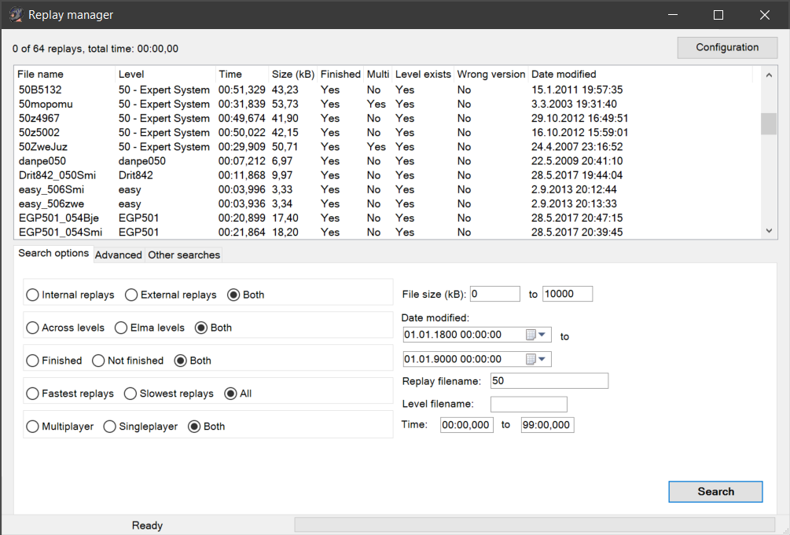
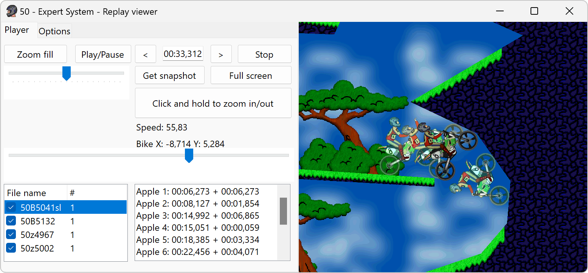
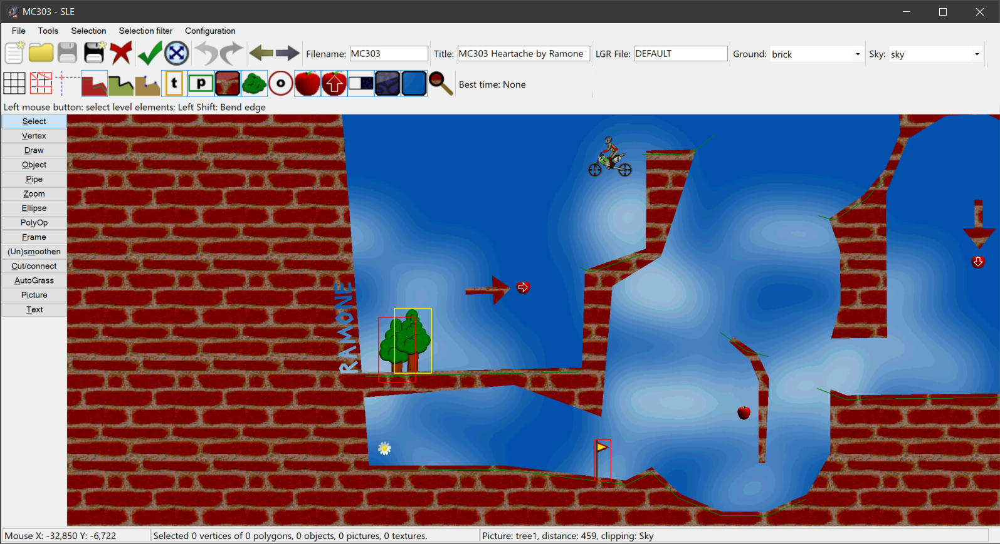

# Elmanager
Elmanager is a manager program for [Elasto Mania](http://www.elastomania.com) written in C#. Most important features include replay searching and viewing and a level editor.

## System requirements
Windows XP/Vista/7/8 with [.NET Framework 4](http://download.microsoft.com/download/9/5/A/95A9616B-7A37-4AF6-BC36-D6EA96C8DAAE/dotNetFx40_Full_x86_x64.exe).

## Installation
Unzip `Elmanager.zip` to any directory, such as `C:\Elma\Elmanager`. The ZIP file contains 2 DLL files that are required for the program to work correctly (keep them in the same directory as `Elmanager.exe`). Program settings are also saved in this directory.

## Features
Elmanager has basically two components: replay manager and a level editor (named SLE).

### Replay manager

Replay manager provides lots of functions for managing your replay files.

  -   Replay searching with many parameters
      -   Internal/external replays
      -   Finished/unfinished replays
      -   Singleplayer/multiplayer replays
      -   Replays driven in Across/Elma levels
      -   Replays whose time matches the specified range
      -   Replays driven in specified levels
      -   Replays with wrong level version
      -   Replays with a missing level file
      -   Replays whose filename matches the specified regular expression
      -   Replays whose appletakes/left volts/right volts/supervolts/turns/groundtouches match the specified ranges
  -   Duplicate replay search
  -   Duplicate filename search
  -   Best replay search
  -   Replay renaming
  -   Replay list that displays properties of replays
      -   Filename
      -   Filename of level
      -   Time
      -   Whether the replay is finished/unfinished
      -   Multiplayer/singleplayer
      -   Whether the level exists for the replay
      -   Wrong version of level
      -   Hover mouse cursor above a replay to show more information (appletakes, left volts, ...)
  -   Replay viewer
      -   Watch as many players in the same level as you want simultaneously
      -   OpenGL rendering
      -   Choose LGR file in configuration window to play the replay with same graphics as in game
      -   Customizable colors for apples, killers, active/inactive player, flower, start object, driving lines, ground and sky
      -   Smooth zooming
      -   Event list displaying the selected events for selected player
      -   Fullscreen mode
      -   Locked camera -mode (for fun)
  -   Replay comparison
      -   Compare replays by apples or groundtouches
  -   Move or copy selected replays to anywhere
  -   Open level file of a replay with the default program
  -   Replay renaming with pattern
  -   Save properties of selected replays to a text file
  -   Merge two singleplayer replays to a multiplayer replay

#### Screenshots

### Level editor (SLE)

The level editor (SLE, Smibu's Level Editor) allows you to create levels easily. You can customize various colors for the editor.

SLE has various tools:

  -   Create pipe
  -   Draw ground with pencil
  -   Dynamic topology checking
  -   Frame polygons
  -   Cut/connect polygons
  -   Smoothen/unsmoothen polygons
  -   Lock mouse horizontally or vertically
  -   Transform selected objects
  -   AutoGrass
  -   QuickGrass
  -   Undo/redo
  -   Grid
  -   Mirror level
  -   Edge bending
  -   Polygon operations (merge, difference)
  -   Type text

#### Screenshots

