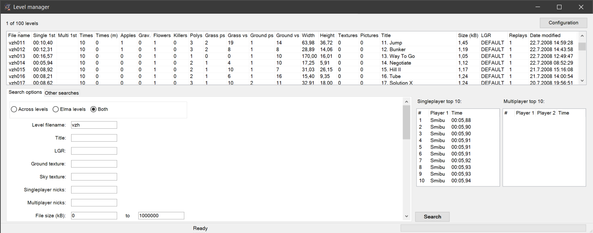

# Elmanager
Elmanager is a tool for managing [Elasto Mania](https://elastomania.com) replays and levels. Most important features include replay/level searching and viewing and a level editor.

## System requirements
Windows 10/11.

## Installation
Unzip `Elmanager.zip` to any directory, such as `C:\Elma\Elmanager`. Program settings are also saved in this directory.

## Features
Elmanager has three components: replay manager, level manager and a level editor (named SLE, "Smibu's level editor").

### Replay manager

  -   Replay searching with many parameters
      -   Internal/external replays
      -   Finished/unfinished replays
      -   Singleplayer/multiplayer replays
      -   Replays driven in Across/Elma levels
      -   Replays whose time matches the specified range
      -   Replays driven in specified levels
      -   Replays with wrong level version
      -   Replays with a missing level file
      -   Replays whose filename matches the specified regular expression
      -   Replays whose appletakes/left volts/right volts/supervolts/turns/groundtouches match the specified ranges
  -   Duplicate replay search
  -   Duplicate filename search
  -   Fastest/slowest replay search (return only one replay per level)
  -   Replay renaming
  -   Replay mass renaming using pattern
  -   Replay list that displays properties of replays
      -   Filename
      -   Filename of level
      -   Time
      -   Whether the replay is finished/unfinished
      -   Multiplayer/singleplayer
      -   Whether the level exists for the replay
      -   Whether the level version is wrong
      -   Hover mouse cursor above a replay to show more information (appletakes, left volts, etc.)
  -   Replay viewer
      -   Watch as many players in the same level as you want simultaneously
      -   Choose LGR file in configuration window to play the replay with same graphics as in game
      -   Customizable colors for apples, killers, active/inactive player, flower, start object, driving lines, ground and sky
      -   Event list displaying the selected events for selected player
      -   Fullscreen mode
  -   Replay comparison
      -   Compare replays by apples or groundtouches
  -   Open level file of a replay with the default program
  -   Save properties of selected replays to a text file
  -   Merge two singleplayer replays to a multiplayer replay

### Level manager

- Search levels
  - File name
  - Best time (single/multi)
  - Number of replays
  - Number of grass/ground polygons/vertices
  - Nicknames in best times
  - Number of (gravity up/down/left/right) apples/killers/flowers
- Delete selected times from top 10
- View replays in a level

### Level editor (SLE)

  -   Create pipes
  -   Create ellipses
  -   Continuous topology checking
  -   Frame polygons
  -   Cut/connect polygons
  -   Smoothen/unsmoothen polygons
  -   Lock mouse horizontally or vertically
  -   Transform selection
  -   Autograss
  -   Quickgrass (apply autograss to all polygons)
  -   Undo/redo
  -   Grid, snap to grid
  -   Mirror level
  -   Polygon boolean operations (union, difference, intersection, symmetric difference)
  -   Create text with almost any system font
  -   Many customizable options (e.g. colors)

