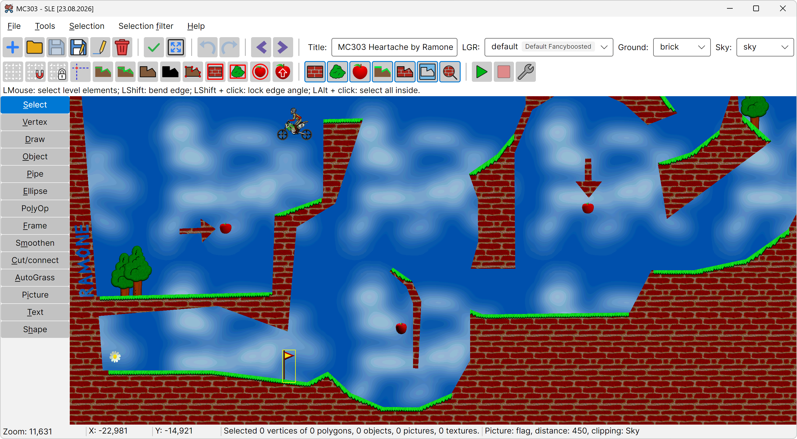
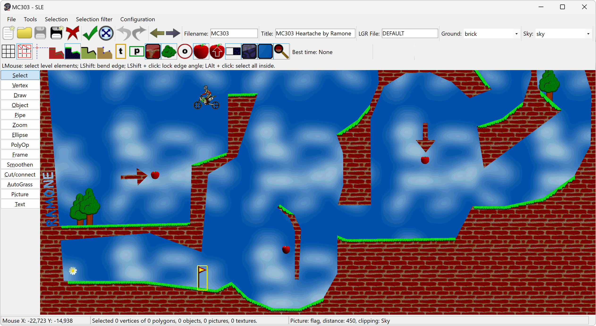
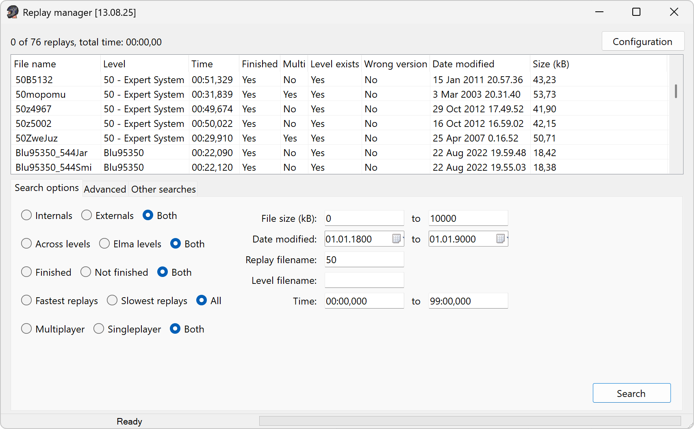
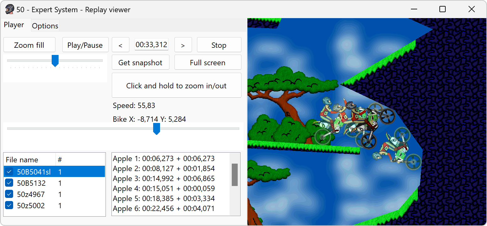
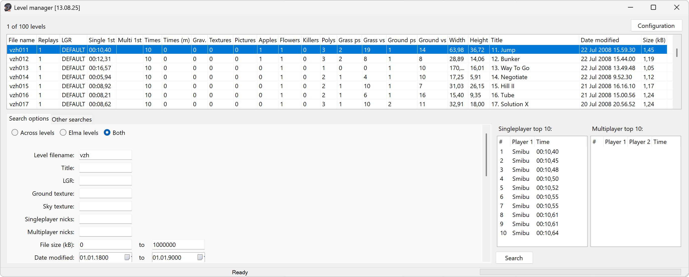

# Elmanager

Elmanager is a collection of tools for [Elasto Mania](https://elastomania.com):

* SLE: level editor, also available on web at https://sle.m-l.fi
* replay manager: replay searching and viewing
* level manager: level searching

SLE (in-development Avalonia UI version):

SLE (old Windows Forms version):

Replay manager:

Replay viewer:

Level manager:

## System requirements

Windows 10/11. The in-development version of SLE is cross-platform.

## Installation

Unzip `Elmanager.zip` to any directory, such as `C:\Elma\Elmanager`. Program settings are also saved in this directory.
